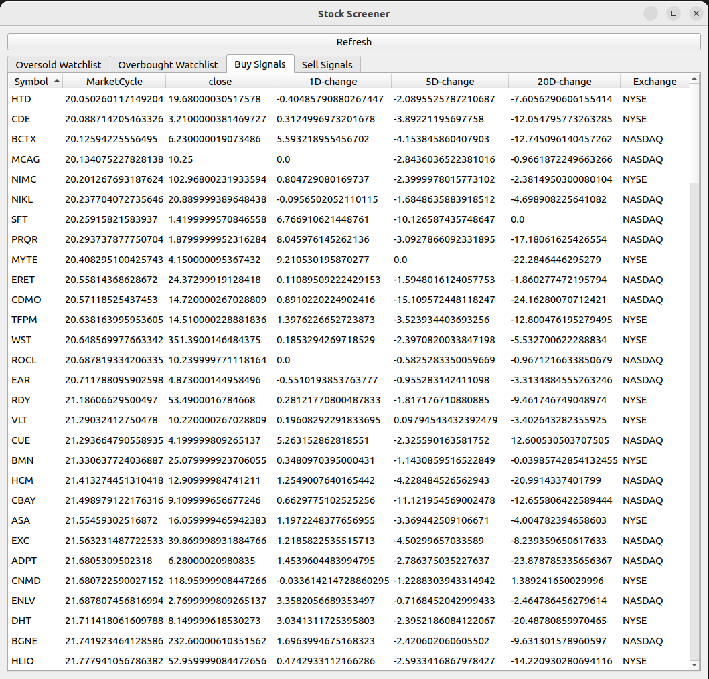

# Market Cycles Stock Screener

Stock Screener, scans the NYSE & NASDAQ and displays a QT5 UI with Buys & Sells watchlists

The Market Cycle indicator is a weighted average of the RSI, Stochastic RSI & Stochastic Oscillator.

I found it to be useful in finding the peaks and bottoms without much lag.

It returns a value in the range [0; 100]. Read it like the RSI indicator: < 20 is oversold, > 80 is overbought.

Tradingview indicator: https://www.tradingview.com/script/KutjMaH0-Market-Cycle-Indicator/

## Install

`pip install -r requirements.txt`

## Run

`python main.py`

## Screenshots

### Stock Screener

### Market Cycle Indicator

